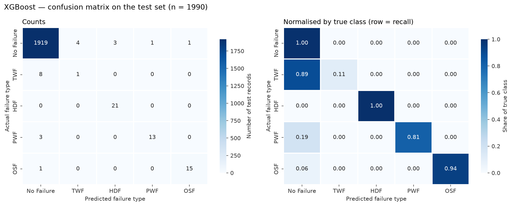
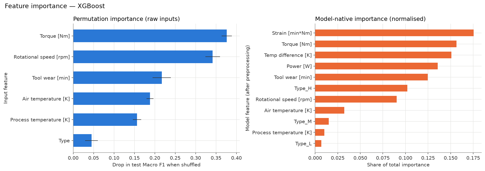
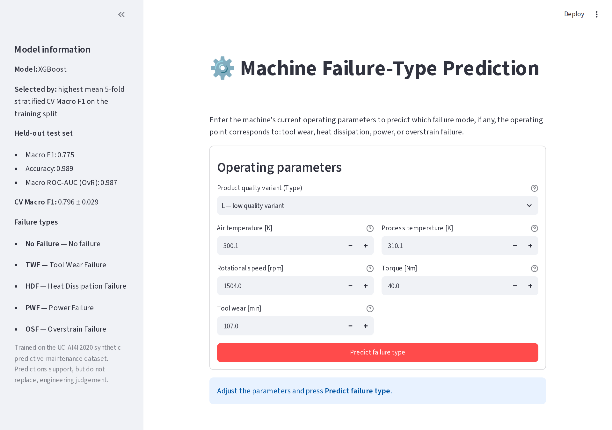
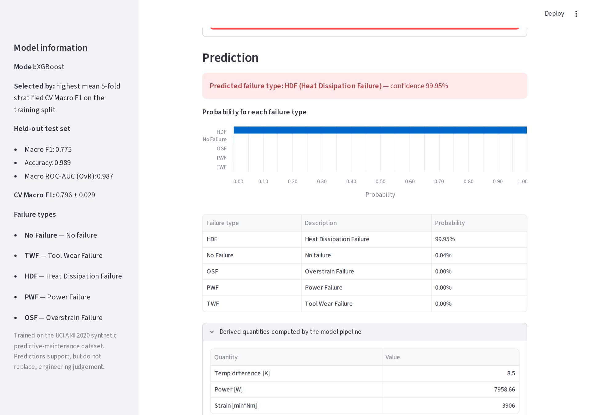

# ⚙️ Manufacturing Machine Failure-Type Prediction

Multi-class prediction of **which failure mode** a milling machine is in — Tool Wear, Heat Dissipation, Power, or Overstrain failure, or no failure — from six operating parameters, using the [UCI AI4I 2020 Predictive Maintenance Dataset](https://archive.ics.uci.edu/dataset/601/ai4i+2020+predictive+maintenance+dataset). The project compares a baseline, Random Forest (bagging), XGBoost (boosting), CatBoost (advanced boosting), and a stacking ensemble, and deploys the selected model as a Streamlit app.

> Every number in this README was produced by the code in this repository (`reports/` holds the raw outputs).

---

## 📌 Overview

| | |
|---|---|
| **Task** | Supervised, multi-class, heavily imbalanced classification (5 classes) |
| **Data** | 10,000 machine snapshots → 9,950 after label cleaning |
| **Primary metric** | Macro F1 (every failure class weighs the same as "No Failure") |
| **Validation** | Stratified 80/20 split; stratified 5-fold CV on the training split for all tuning and selection |
| **Final model** | XGBoost — test Macro F1 **0.775**, accuracy **0.989**, macro OvR ROC-AUC **0.987** |
| **Deployment** | Streamlit app loading one saved scikit-learn pipeline (feature engineering → preprocessing → model) |

---

## 🎯 Problem Statement

Unplanned machine failures stop production and damage tools and workpieces. Predicting *that* a machine will fail is useful; predicting *how* it will fail is more actionable, because each mode has a different remedy (replace the tool, improve cooling, change the speed–torque operating point, reduce load). Given a machine's operating snapshot **X**, the goal is to learn **Failure Type = f(X)**.

---

## 🧭 Objectives

1. Build a leakage-free, reproducible pipeline from raw CSV to deployed model.
2. Engineer physically meaningful features and test whether they help.
3. Compare bagging, boosting, advanced boosting, and stacking against baselines, using Macro F1.
4. Analyse per-class performance, confusion patterns, and misclassified examples.
5. Interpret the final model (permutation importance, SHAP) and deploy it with input validation.

---

## 🗂️ Dataset

UCI AI4I 2020 (id 601), a synthetic dataset modelled on real milling data. 10,000 rows × 14 columns, no missing values, no duplicate rows.

| Column(s) | Role | Used as input? |
|---|---|---|
| `UDI` | Row identifier | No — carries no physical information |
| `Product ID` | Serial number, unique per row; first letter equals `Type` | No — cannot generalise, redundant with `Type` |
| `Type` (L / M / H) | Product quality variant | **Yes** |
| Air temperature [K], Process temperature [K], Rotational speed [rpm], Torque [Nm], Tool wear [min] | Sensor readings | **Yes** |
| `Machine failure` | Binary summary of the target | No — direct target leakage |
| `TWF`, `HDF`, `PWF`, `OSF`, `RNF` | Failure-mode flags | No — used only to build the target |

### Target construction
The file has no single failure-type column, so one was built from the mode flags.

- **Classes:** No Failure, TWF, HDF, PWF, OSF.
- **RNF (random failure) is not a class.** The dataset documentation describes it as independent of the process parameters, and 18 of its 19 rows contradict `Machine failure = 0`.
- **50 rows (0.5%) were excluded and logged** in `reports/stage3/excluded_rows.csv`:
  - 23 rows have more than one mode set,
  - 18 RNF rows contradict `Machine failure`,
  - 9 rows are failures with no recorded mode.

| Class | Rows | Share |
|---|---:|---:|
| No Failure | 9,643 | 96.91% |
| HDF — Heat Dissipation Failure | 106 | 1.07% |
| PWF — Power Failure | 80 | 0.80% |
| OSF — Overstrain Failure | 78 | 0.78% |
| TWF — Tool Wear Failure | 43 | 0.43% |

---

## 🧪 Features

The six raw inputs plus three engineered physical quantities, computed inside the pipeline by `FeatureEngineer` so training and the app use identical code:

| Feature | Formula | Why |
|---|---|---|
| Temp difference [K] | Process temp − Air temp | Small gap = poor heat removal; HDF clusters at the smallest gaps |
| Power [W] | Torque × rpm × 2π / 60 | PWF occurs at both extremes of mechanical power |
| Strain [min·Nm] | Tool wear × Torque | OSF needs a worn tool *and* high load |

Adding them raised 5-fold CV Macro F1 (mean of RF and XGBoost) from **0.684 to 0.791**. Dropping the two raw temperatures afterwards gave 0.789, so all features were kept (`reports/stage5/feature_set_comparison.csv`).

---

## 🔬 Methodology

```
raw CSV ─► label cleaning & target (Stage 3) ─► stratified 80/20 split (Stage 6)
                                                   │
          training split only ◄────────────────────┤
          ├─ feature-set selection (5-fold CV)      │
          ├─ tuning: RandomizedSearchCV / GridSearchCV, f1_macro, StratifiedKFold(5, shuffle, 42)
          └─ model selection: highest mean CV Macro F1
                                                   │
          test split (read once) ◄─────────────────┘ final evaluation only
```

Feature engineering and preprocessing live inside each model's `Pipeline`, so they are refitted within every CV fold. `random_state = 42` everywhere.

---

## 🤖 Models

| Model | Role | Tuning |
|---|---|---|
| `DummyClassifier(most_frequent)` | Floor | none |
| Logistic Regression | Simple ML baseline (standardised inputs) | GridSearchCV, 10 candidates |
| Random Forest | Bagging | RandomizedSearchCV, 30 candidates |
| XGBoost (`multi:softprob`) | Boosting; class weighting via balanced sample weights | RandomizedSearchCV, 30 candidates |
| CatBoost | Advanced boosting (ordered boosting, symmetric trees) | RandomizedSearchCV, 20 candidates |
| Stacking | RF + XGBoost + CatBoost → balanced Logistic Regression on out-of-fold probabilities | GridSearchCV on meta-learner C |

---

## 📏 Evaluation Metrics

- **Macro F1:** the primary metric.
- **Accuracy**, **macro and weighted precision / recall / F1**.
- **One-vs-Rest ROC-AUC**, both macro and support-weighted.
- **Per-class metrics** and **confusion matrices**.

> Accuracy alone is misleading here: predicting "No Failure" for every row scores 96.9% accuracy but only 0.197 Macro F1.

---

## 📊 Results

CV = mean ± std of 5-fold stratified CV Macro F1 on the training split. All other columns are on the untouched test split (1,990 rows). Precision, Recall and F1 are macro-averaged.

| Model | CV Macro F1 | Accuracy | Precision | Recall | F1 | ROC-AUC (macro) |
|---|---:|---:|---:|---:|---:|---:|
| Baseline (Dummy) | 0.197 ± 0.000 | 0.969 | 0.194 | 0.200 | 0.197 | 0.500 |
| Baseline (Logistic Regression) | 0.708 ± 0.042 | 0.982 | 0.712 | 0.613 | 0.646 | 0.989 |
| Random Forest | 0.791 ± 0.013 | 0.955 | 0.759 | 0.912 | 0.777 | 0.991 |
| XGBoost | **0.796 ± 0.029** | **0.989** | **0.787** | 0.771 | 0.775 | 0.987 |
| CatBoost | 0.777 ± 0.030 | 0.987 | 0.732 | 0.715 | 0.720 | 0.988 |
| Stacking | 0.788 ± 0.010 | 0.947 | 0.778 | **0.967** | **0.802** | **0.991** |
| **Best model (XGBoost)** | **0.796** | **0.989** | **0.787** | **0.771** | **0.775** | **0.987** |

**Selection.** The rule was fixed in advance: highest mean CV Macro F1. That selects XGBoost. The test set measures the chosen model but never chooses it.

**Stacking and Random Forest have higher test Macro F1, at a cost.** Most of their gain comes from catching TWF, and they pay for it with many false alarms:

| On the test set | XGBoost | Random Forest | Stacking |
|---|---:|---:|---:|
| False alarms (No Failure predicted as a failure) | 9 | 85 | 105 |
| Missed failures (failure predicted as No Failure) | 12 | 3 | 1 |

Which trade-off is better depends on the relative cost of a false alarm versus a missed failure. See **Limitations**.

**Final model per class (test):**

| Class | Precision | Recall | F1 | Support |
|---|---:|---:|---:|---:|
| No Failure | 0.994 | 0.995 | 0.995 | 1,928 |
| HDF | 0.875 | 1.000 | 0.933 | 21 |
| OSF | 0.938 | 0.938 | 0.938 | 16 |
| PWF | 0.929 | 0.813 | 0.867 | 16 |
| TWF | 0.200 | 0.111 | 0.143 | 9 |

HDF, OSF, and PWF are predicted well. Excluding TWF, Macro F1 is 0.933.

---

## 🧩 Confusion Matrix



The main confusion is **TWF → No Failure** (8 of 9 TWF rows). In the training data, only 4.8% of rows in the 198–246 min tool-wear band where TWF occurs are TWF. The other rows are mostly No Failure with overlapping sensor values, so no input separates them.

The remaining errors sit on narrow class boundaries in the training data:
- The missed PWF rows are at 9,009–9,014 W. In training, No Failure tops out at 8,990 W and PWF starts at 9,020 W.
- The missed OSF row (L-type) has strain 11,003 min·Nm. In training, L-type No Failure tops out at 10,994 and OSF starts at 11,019.

Evidence: `reports/evaluation/class_boundary_evidence.csv` and `reports/misclassification_analysis.csv`.

---

## 🔍 Feature Importance



- **Permutation importance** (drop in test Macro F1 when shuffled): Torque 0.376, Rotational speed 0.342, Tool wear 0.217, Air temperature 0.188, Process temperature 0.156, Type 0.045.
- **SHAP** (`figures/16_shap_mean_abs_by_class.png`) links each failure class to its physical driver:
  - Strain → OSF
  - Power → PWF
  - Temperature difference and rpm → HDF
  - Tool wear → TWF
  - Type L → OSF

> Importance shows what the model relies on, not causation.

---

## 🚀 Deployment

`app.py` loads `models/final_model.joblib`, the complete fitted pipeline. The app:
- validates inputs: missing values, non-numeric input, physical limits, process temperature above air temperature, and a warning outside the training range;
- shows the predicted failure type and the probability of every class.

It does not re-implement any preprocessing.

| Input form | Prediction |
|---|---|
|  |  |

---

## 📂 Project Structure

```
machine-failure-prediction/
├── app.py                     Streamlit app
├── config.py                  paths, column groups, class order, random seed
├── run_pipeline.py            runs every training stage in order
├── requirements.txt           pinned dependencies
├── PROJECT_CHECKLIST.md       stage-by-stage completion checklist
├── data/
│   ├── raw/ai4i2020.csv       original UCI file (never modified)
│   └── processed/             cleaned data, train.csv, test.csv
├── src/
│   ├── data_loading.py        load + schema check
│   ├── data_understanding.py  Stage 2 statistics and figures
│   ├── preprocessing.py       Stage 3: target, exclusions, validity checks, ColumnTransformer, split
│   ├── eda.py                 Stage 4 figures
│   ├── feature_engineering.py FeatureEngineer transformer
│   ├── feature_study.py       Stages 5–6: split, feature-set comparison
│   ├── models.py              estimators, search spaces, stacking
│   ├── tuning.py              Stages 7–12: CV and hyperparameter search
│   ├── evaluation.py          metrics, confusion matrices, ROC
│   ├── final_evaluation.py    Stages 13–17: test evaluation, interpretation, saving
│   ├── inference.py           input validation + prediction (used by app and tests)
│   ├── plotting.py, utils.py
├── notebooks/                 01–10, executed, one per stage group
├── models/
│   ├── final_model.joblib           complete pipeline (use this)
│   ├── preprocessing_pipeline.joblib fitted feature engineering + preprocessing only
│   ├── model_metadata.json          classes, metrics, training ranges, versions
│   └── candidates/                  every tuned model
├── reports/                   CSV/TXT results, logs, final report (.docx), presentation (.pptx)
├── figures/                   all figures, app screenshots
└── tests/                     pytest suite (36 tests)
```

---

## ⚙️ Installation

Python 3.11 was used.

```bash
git clone <repository-url>
cd machine-failure-prediction
python -m venv venv
venv\Scripts\activate          # Windows
source venv/bin/activate       # Linux / macOS
pip install -r requirements.txt
```

---

## 🚦 Usage

### How to train
```bash
python run_pipeline.py                 # all stages, about 20 minutes on 2 CPU cores
python run_pipeline.py --from tuning   # resume from a given stage
```

### How to run Streamlit
```bash
streamlit run app.py
```

### Example prediction
```python
from src.inference import load_artifacts, predict

pipeline, metadata = load_artifacts()
label, probabilities = predict(pipeline, {
    "Type": "L", "Air temperature [K]": 301.6, "Process temperature [K]": 310.1,
    "Rotational speed [rpm]": 1362, "Torque [Nm]": 55.8, "Tool wear [min]": 70,
})
print(label)          # HDF  (a real HDF row from the test set)
```

---

## 🧪 Testing

```bash
pytest
```

There are 36 tests. They cover data loading, target construction and exclusions, leakage checks, the split, feature engineering, model loading, and prediction validity. They also check that the saved test score reproduces, and drive the real Streamlit app headlessly.

---

## 🛠️ Technologies Used

Python 3.11 · pandas · NumPy · scikit-learn · XGBoost · CatBoost · SHAP · matplotlib · seaborn · joblib · Streamlit · pytest · Jupyter

---

## 📄 License

This project is open-source. Feel free to use, modify, and distribute it as per your needs (add your preferred license, e.g. MIT, here).
